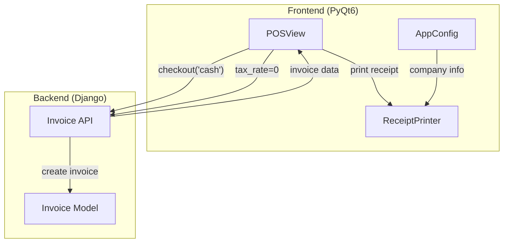

# Design Document: POS Improvements

## Overview

This design document describes the implementation of improvements to the Point of Sale (نقطة البيع) system. The improvements include enabling full cash payment functionality, disabling tax for all POS transactions, and ensuring receipt printing works correctly.

The implementation modifies the existing `POSView` class in the frontend and the `ReceiptPrinter` class to support these features.

## Architecture



## Components and Interfaces

### 1. POSView Component (Modified)

**Location:** `frontend/src/views/sales/__init__.py`

**New Attributes:**
```python
class POSView(QWidget):
    # Existing attributes...
    last_completed_invoice: Optional[Dict] = None  # Store last invoice for printing
```

**Modified Methods:**

#### `create_pos_invoice(payment_method: str, override_reason: str = None)`
- Always set `tax_rate=0` for all items regardless of global settings
- For cash payments, set `paid_amount` equal to `total_amount`
- Store completed invoice data in `last_completed_invoice`
- Trigger receipt printing for cash sales (optional)

#### `checkout(payment_method: str)`
- For cash/card payments, proceed directly without customer requirement
- Call `create_pos_invoice` with appropriate payment method

#### `print_receipt()`
- New method to handle print button click
- Check if `last_completed_invoice` exists
- Call `ReceiptPrinter.print_receipt()` with invoice data
- Handle errors gracefully

#### `update_totals()`
- Always display tax as 0.00 for POS

### 2. ReceiptPrinter Component (Modified)

**Location:** `frontend/src/printing/receipt.py`

**Modified Methods:**

#### `generate(invoice_data: Dict) -> str`
- Handle tax display based on invoice data (show 0.00 if tax_amount is 0)
- Ensure all required fields are included in receipt

### 3. Print Button Integration

**UI Changes:**
- Connect print button to `print_receipt()` method
- Show appropriate messages for success/failure/no invoice

## Data Models

### Invoice Data Structure (POS)

```python
invoice_data = {
    'warehouse': int,                    # Warehouse ID
    'invoice_type': str,                 # 'cash' | 'credit' | 'card'
    'invoice_date': str,                 # 'YYYY-MM-DD'
    'customer': Optional[int],           # Customer ID (optional for cash)
    'items': [
        {
            'product': int,              # Product ID
            'quantity': int,             # Quantity
            'unit_price': float,         # Unit price
            'tax_rate': 0                # Always 0 for POS
        }
    ],
    'confirm': True,                     # Auto-confirm
    'paid_amount': float,                # Full amount for cash
    'payment_method': str                # 'cash' | 'card'
}
```

### Last Completed Invoice Structure

```python
last_completed_invoice = {
    'invoice_number': str,
    'invoice_date': str,
    'customer': Optional[Dict],
    'items': List[Dict],
    'subtotal': float,
    'discount_amount': float,
    'tax_amount': float,                 # Always 0 for POS
    'total_amount': float,
    'payment_method': str,
    'amount_paid': float
}
```

## Correctness Properties

*A property is a characteristic or behavior that should hold true across all valid executions of a system-essentially, a formal statement about what the system should do. Properties serve as the bridge between human-readable specifications and machine-verifiable correctness guarantees.*

### Property 1: Cash Payment Creates Fully Paid Invoice

*For any* cart with items and a cash payment method, when checkout is completed, the invoice SHALL have `paid_amount` equal to `total_amount` and status set to 'paid'.

**Validates: Requirements 1.1, 1.2**

### Property 2: POS Transactions Are Tax-Free

*For any* POS transaction (cash, card, or credit), all items in the invoice data SHALL have `tax_rate` set to 0, and the displayed tax amount SHALL be 0.00.

**Validates: Requirements 2.1, 2.2, 2.3**

### Property 3: Cart Cleared After Successful Payment

*For any* successful checkout (cash, card, or credit), the cart_items list SHALL be empty after the transaction completes.

**Validates: Requirements 1.4**

### Property 4: Receipt Contains Required Information

*For any* invoice data passed to the receipt printer, the generated receipt text SHALL contain:
- Company name (if configured)
- Invoice number
- Invoice date
- All item names and quantities
- Subtotal and total amount
- Payment method label

**Validates: Requirements 3.2, 3.3, 3.4, 3.5, 3.6**

### Property 5: Last Invoice Stored for Printing

*For any* successful checkout, the `last_completed_invoice` attribute SHALL contain the invoice data returned from the API.

**Validates: Requirements 4.1**

## Error Handling

| Scenario | Handling |
|----------|----------|
| Empty cart checkout | Display warning "السلة فارغة" |
| No warehouse configured | Display error "لم يتم تحديد المستودع الافتراضي" |
| API error during invoice creation | Display error with API message |
| Print button with no invoice | Display warning "لا توجد فاتورة للطباعة" |
| Printer not available | Fall back to text file |
| Cash drawer command fails | Silent failure, continue operation |

## Testing Strategy

### Unit Tests
- Test `update_totals()` always shows tax as 0
- Test invoice data structure has tax_rate=0 for all items
- Test `last_completed_invoice` is set after checkout
- Test print button shows warning when no invoice

### Property-Based Tests
Using Python's `hypothesis` library:

1. **Property 1 Test**: Generate random cart items, perform cash checkout, verify paid_amount equals total_amount
2. **Property 2 Test**: Generate random cart items, verify all items have tax_rate=0 in invoice data
3. **Property 3 Test**: Generate random cart items, perform checkout, verify cart is empty
4. **Property 4 Test**: Generate random invoice data, verify receipt contains all required fields
5. **Property 5 Test**: Generate random cart items, perform checkout, verify last_completed_invoice is set

### Integration Tests
- Test full cash payment flow from cart to invoice creation
- Test receipt printing with mock printer
- Test print button integration

### Test Configuration
- Minimum 100 iterations per property test
- Tag format: **Feature: pos-improvements, Property {number}: {property_text}**
