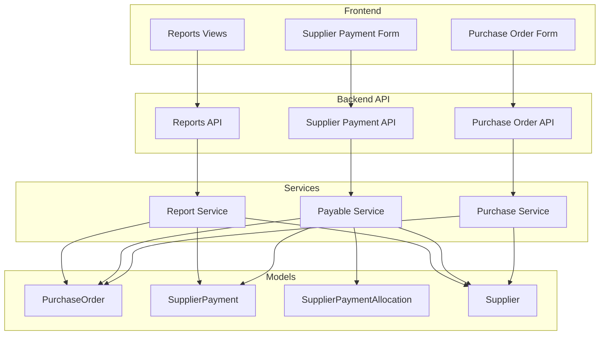
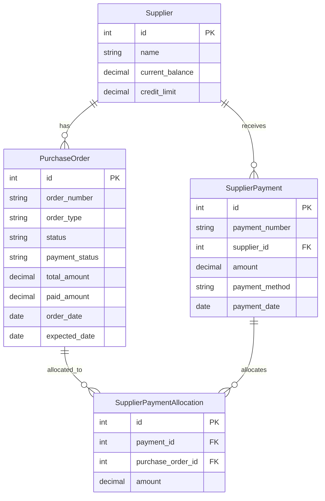
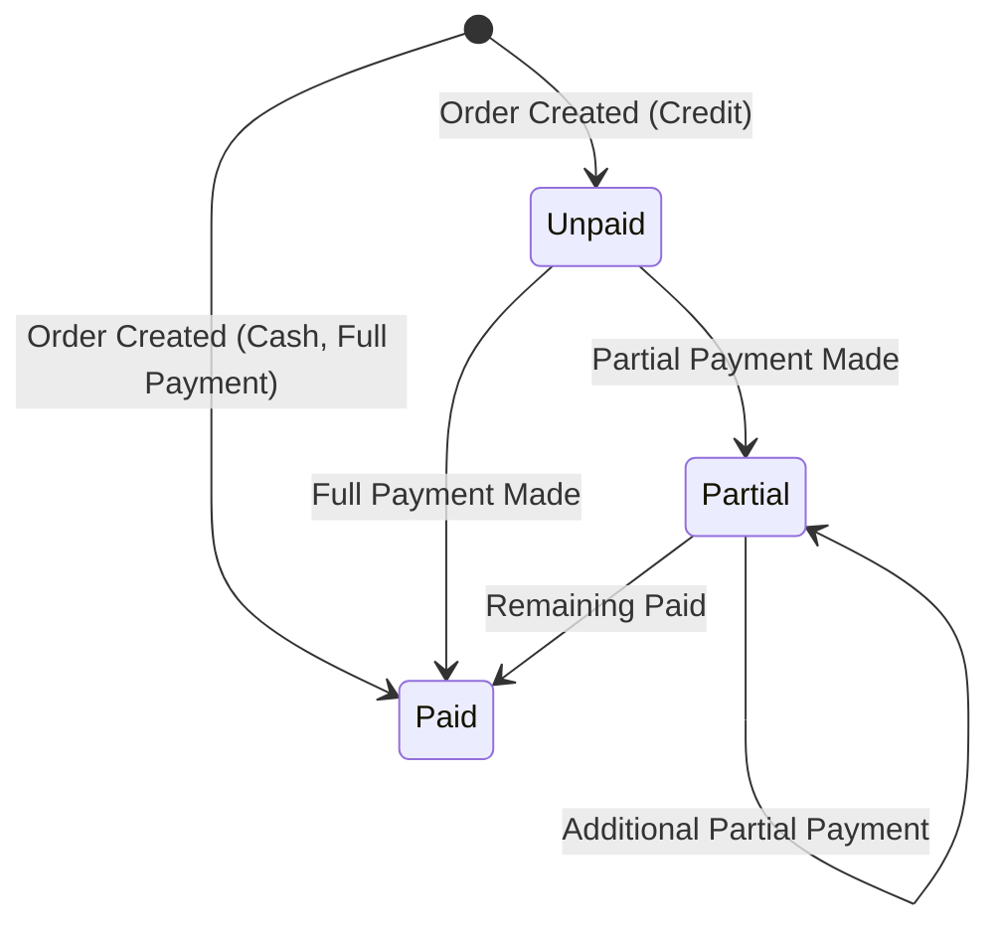

# Design Document: Supplier Partial Payments

## Overview

This design implements partial payment functionality for supplier purchases, mirroring the existing credit sales payment system. The feature enables users to make full or partial payments when creating purchase orders, track supplier balances, allocate payments to specific orders, and generate comprehensive accounts payable reports.

The implementation follows the existing patterns established in the sales module (`credit_service.py`, `Payment`, `PaymentAllocation` models) to ensure consistency across the application.

## Architecture



## Components and Interfaces

### 1. Backend Models

#### PurchaseOrder Model Updates
The existing `PurchaseOrder` model already has `paid_amount` and `remaining_amount` fields. We need to add:

```python
class PurchaseOrder(BaseModel):
    class OrderType(models.TextChoices):
        CASH = 'cash', 'نقدي'
        CREDIT = 'credit', 'آجل'
    
    order_type = models.CharField(
        max_length=20,
        choices=OrderType.choices,
        default=OrderType.CREDIT,
        verbose_name='نوع الطلب'
    )
    
    class PaymentStatus(models.TextChoices):
        UNPAID = 'unpaid', 'غير مدفوع'
        PARTIAL = 'partial', 'مدفوع جزئياً'
        PAID = 'paid', 'مدفوع'
    
    payment_status = models.CharField(
        max_length=20,
        choices=PaymentStatus.choices,
        default=PaymentStatus.UNPAID,
        verbose_name='حالة الدفع'
    )
```

#### SupplierPaymentAllocation Model (New)
```python
class SupplierPaymentAllocation(BaseModel):
    """
    Tracks allocation of supplier payments to specific purchase orders.
    Enables partial payments across multiple orders.
    """
    payment = models.ForeignKey(
        SupplierPayment,
        on_delete=models.CASCADE,
        related_name='allocations'
    )
    purchase_order = models.ForeignKey(
        PurchaseOrder,
        on_delete=models.PROTECT,
        related_name='payment_allocations'
    )
    amount = models.DecimalField(max_digits=15, decimal_places=2)
    
    class Meta:
        unique_together = ['payment', 'purchase_order']
```

### 2. Backend Services

#### PayableService (New)
Located at `backend/apps/purchases/payable_service.py`:

```python
class PayableService:
    """Service for accounts payable business logic."""
    
    @staticmethod
    def update_payment_status(purchase_order: PurchaseOrder) -> str:
        """Determine and update payment status based on paid_amount."""
        
    @staticmethod
    def update_supplier_balance(supplier_id: int, amount: Decimal, is_debit: bool):
        """Update supplier's current_balance."""
        
    @staticmethod
    def allocate_payment(
        payment_id: int,
        allocations: List[Dict] = None,
        auto_allocate: bool = False
    ) -> List[SupplierPaymentAllocation]:
        """Allocate payment to purchase orders."""
        
    @staticmethod
    def get_supplier_unpaid_orders(supplier_id: int) -> List[Dict]:
        """Get unpaid/partial orders for a supplier."""
```

### 3. Frontend Components

#### PurchaseOrderFormDialog Updates
Add payment type selection and paid amount entry:
- Order type combo (cash/credit)
- Paid amount spin box
- Full payment button
- Payment status display

#### SupplierPaymentDialog (New)
Dialog for creating supplier payments with allocation:
- Supplier selection
- Payment amount and method
- Unpaid orders table with allocation amounts
- Auto-allocate button (FIFO)

### 4. API Endpoints

| Endpoint | Method | Description |
|----------|--------|-------------|
| `/api/v1/purchases/orders/{id}/` | PATCH | Update order with payment |
| `/api/v1/purchases/supplier-payments/` | POST | Create supplier payment |
| `/api/v1/purchases/supplier-payments/{id}/allocate/` | POST | Allocate payment to orders |
| `/api/v1/purchases/suppliers/{id}/unpaid-orders/` | GET | Get unpaid orders |
| `/api/v1/purchases/suppliers/{id}/statement/` | GET | Get supplier statement |
| `/api/v1/reports/payables/` | GET | Accounts payable report |
| `/api/v1/reports/payables/aging/` | GET | Aging report |

## Data Models

### Entity Relationship Diagram



### Payment Status State Machine



## Correctness Properties

*A property is a characteristic or behavior that should hold true across all valid executions of a system—essentially, a formal statement about what the system should do. Properties serve as the bridge between human-readable specifications and machine-verifiable correctness guarantees.*

### Property 1: Remaining Amount Calculation
*For any* purchase order with total_amount and paid_amount, the remaining_amount SHALL equal total_amount minus paid_amount.

**Validates: Requirements 1.4**

### Property 2: Payment Status Determination
*For any* purchase order:
- If paid_amount equals 0, payment_status SHALL be 'unpaid'
- If 0 < paid_amount < total_amount, payment_status SHALL be 'partial'
- If paid_amount equals total_amount, payment_status SHALL be 'paid'

**Validates: Requirements 2.1, 2.3, 2.4**

### Property 3: Paid Amount Constraint
*For any* purchase order, paid_amount SHALL NOT exceed total_amount.

**Validates: Requirements 2.5**

### Property 4: Supplier Balance Consistency
*For any* supplier, current_balance SHALL equal opening_balance plus sum of all credit purchase order remaining amounts minus sum of all payment amounts.

**Validates: Requirements 3.1, 3.2, 3.3**

### Property 5: Payment Number Uniqueness
*For any* two supplier payments, their payment_number values SHALL be different.

**Validates: Requirements 4.2**

### Property 6: Unpaid Orders Filter
*For any* supplier, the unpaid orders list SHALL contain only orders with payment_status in ('unpaid', 'partial').

**Validates: Requirements 5.1**

### Property 7: FIFO Allocation Order
*For any* auto-allocation, payments SHALL be applied to orders in ascending order_date order (oldest first).

**Validates: Requirements 5.3**

### Property 8: Allocation Updates Order Status
*For any* payment allocation to a purchase order, the order's paid_amount SHALL increase by the allocation amount, and payment_status SHALL update accordingly.

**Validates: Requirements 5.4**

### Property 9: Allocation Amount Constraint
*For any* allocation attempt where amount exceeds order remaining_amount, the system SHALL reject with an error.

**Validates: Requirements 5.5**

### Property 10: Statement Balance Calculation
*For any* supplier statement, closing_balance SHALL equal opening_balance plus total debits (purchase orders) minus total credits (payments).

**Validates: Requirements 7.1, 7.2, 7.3**

### Property 11: Running Balance Accuracy
*For any* transaction in a supplier statement, its balance SHALL equal the previous transaction's balance plus its debit minus its credit.

**Validates: Requirements 7.3**

### Property 12: Payables Report Total
*For any* accounts payable report, total_outstanding SHALL equal the sum of all supplier current_balance values where current_balance > 0.

**Validates: Requirements 8.1**

### Property 13: Payables Report Sorting
*For any* accounts payable report, suppliers SHALL be sorted by current_balance in descending order.

**Validates: Requirements 8.2**

### Property 14: Aging Bucket Categorization
*For any* purchase order in the aging report, it SHALL appear in exactly one age bucket based on days overdue.

**Validates: Requirements 9.1**

### Property 15: Aging Bucket Totals
*For any* aging bucket, its total SHALL equal the sum of remaining_amount for all orders in that bucket.

**Validates: Requirements 9.2**

## Error Handling

### Validation Errors

| Error Code | Condition | Message (Arabic) |
|------------|-----------|------------------|
| `PAID_EXCEEDS_TOTAL` | paid_amount > total_amount | المبلغ المدفوع يتجاوز إجمالي الطلب |
| `ALLOCATION_EXCEEDS_REMAINING` | allocation > order.remaining | مبلغ التخصيص يتجاوز المتبقي للطلب |
| `INVALID_PAYMENT_AMOUNT` | amount <= 0 | مبلغ الدفع غير صالح |
| `ORDER_NOT_FOUND` | order doesn't exist | أمر الشراء غير موجود |
| `SUPPLIER_MISMATCH` | order.supplier != payment.supplier | أمر الشراء لا يخص هذا المورد |

### Exception Classes

```python
class AllocationExceedsRemainingException(ValidationException):
    """Raised when allocation exceeds order remaining amount."""
    
class InvalidPaymentAmountException(ValidationException):
    """Raised when payment amount is invalid."""
```

## Testing Strategy

### Unit Tests
- Test payment status determination logic
- Test remaining amount calculation
- Test supplier balance updates
- Test allocation validation

### Property-Based Tests
Using Hypothesis library for Python:

1. **Property 1**: Generate random total_amount and paid_amount, verify remaining calculation
2. **Property 2**: Generate random payment scenarios, verify status determination
3. **Property 3**: Generate random amounts, verify paid_amount constraint
4. **Property 4**: Generate random transactions, verify balance consistency
5. **Property 5**: Generate multiple payments, verify uniqueness
6. **Property 6**: Generate orders with various statuses, verify filter
7. **Property 7**: Generate multiple orders, verify FIFO order
8. **Property 8**: Generate allocations, verify order updates
9. **Property 9**: Generate over-allocations, verify rejection
10. **Property 10-11**: Generate statements, verify balance calculations
11. **Property 12-13**: Generate payables data, verify report accuracy
12. **Property 14-15**: Generate aging data, verify categorization

### Integration Tests
- Test full payment flow from order creation to payment allocation
- Test supplier statement generation with multiple transactions
- Test reports with various filter combinations

### Test Configuration
- Minimum 100 iterations per property test
- Use `@settings(max_examples=100)` decorator
- Tag format: `**Feature: supplier-partial-payments, Property N: description**`
